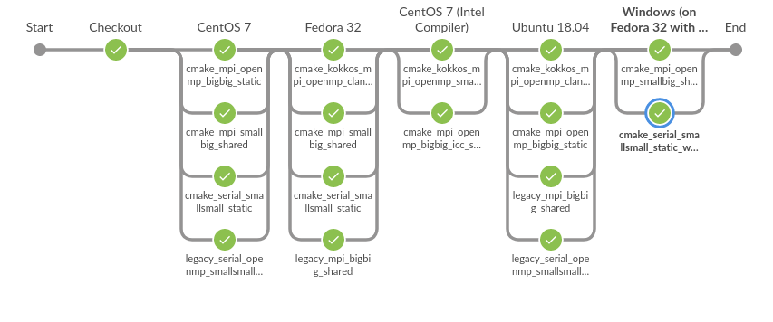

# LAMMPS Test Suite

This repository contains code and examples that drive the regression testing on
[ci.lammps.org](https://ci.lammps.org). It's is run on hardware that is hosted
at Temple University.

The tools provided here can also be installed locally for testing on a workstation.

`lammps_test` is a utility to compile LAMMPS in different configurations on
various environments using containers and perform both run tests
and regression testing.

## Prerequisites

* Singularity (https://sylabs.io/guides/3.5/user-guide/)

## Installation

```bash
# regular install
python setup.py install

# for development install
python setup.py develop
```

## Configuration

```bash
# Example configuration in ~/.bashrc
export LAMMPS_DIR=$HOME/GitHub/lammps/lammps
export LAMMPS_TESTING_DIR=$HOME/GitHub/lammps/lammps-testing
export LAMMPS_CACHE_DIR=$HOME/GitHub/lammps/cache
export LAMMPS_COMPILE_NPROC=24
```

`LAMMPS_DIR`
LAMMPS source directory

`LAMMPS_TESTING_DIR`
LAMMPS testing source directory

`LAMMPS_CACHE_DIR`
Directory storing compiled binaries and containers

## Containers

To make builds reproducable, `lammps_test` uses Singularity containers for
building all binaries. Singularity must be installed and the current user must
have `sudo` rights to build containers.

Container definitions are located in `containers/singularity/`, built
containers are stored in `$LAMMPS_CACHE_DIR/containers/`.

While you can create containers in any way you want using the `singularity`
command-line, there is a utility command for building one or more containers
with `lammps_test`:

```bash
# builds all container definitions at once
lammps_test build_container ALL

# only build ubuntu18.04 container
lammps_test build_container ubuntu18.04

# build multiple containers
lammps_test build_container ubuntu18.04 centos7 fedora30_mingw
```

## Compilation Tests

The compilation tests done by the LAMMPS Jenkins server executes several bash
scripts on multiple containers. Each environment that should be tested defines
a YAML file in the `scripts/` folder. Currently it has 5 definitions:

* ubuntu.yml
* centos.yml
* fedora.yml
* intel.yml
* windows.yml

Each of these environment defines a list of `builds` and the used
`singularity_image`. The names of the builds correspond to bash scripts located
in `scripts/builds/<BUILD_NAME>.sh`.

These build scripts assume the necessary environment variables described above
are defined and will compile LAMMPS in the current working directory.
`lammps_test compilation` is a wrapper command that create the necessary
working directory inside of the `$LAMMPS_CACHE_DIR` folder, and then launches
these scripts inside the correct container.

On ci.lammps.org, these tests are one environment at a time, running multiple compilations in parallel. Below is a visualization of the current compilation test pipeline that both runs for the [master](https://ci.lammps.org/blue/organizations/jenkins/dev%2Fmaster%2Fcompilation_tests/activity) branch (current development version of LAMMPS) and each pull request.



### Running compilation tests locally

You can build all compilation tests at once as follows:

```bash
# this will launch all ubuntu, centos and windows compilation tests
lammps_test compilation
```

To limit the compilation tests to a single environment use the `--config` option:

```bash
# only run ubuntu compilation tests
lammps_test compilation --config ubuntu
```

If only a few builds in an environment should be run specify the builds with `--builds`:


```bash
# only run 'cmake_mpi_smallbig_shared' compilation test on ubuntu
lammps_test compilation --config ubuntu --builds cmake_mpi_smallbig_shared

# run two compilations tests on ubuntu
lammps_test compilation --config ubuntu --builds cmake_serial_smallsmall_static cmake_mpi_smallbig_shared
```

## Build directories
Each build will create its own working directory based on the current Git SHA
of the `LAMMPS_DIR` checkout.

It will be located in: `$LAMMPS_CACHE_DIR/builds_<CURENT_LAMMPS_SHA>/<CONFIG_NAME>/<BUILD_NAME>`

### Example:
```bash
lammps_test compilation --config ubuntu --builds cmake_mpi_smallbig_shared
```

will create the folder:
`$LAMMPS_CACHE_DIR/builds_<CURENT_LAMMPS_SHA>/ubuntu/cmake_mpi_smallbig_shared`

To modify this behaviour and use the same build directory, independent of the current SHA, use the `--ignore-commit` option:

### Example:
```bash
lammps_test compilation --config ubuntu --builds cmake_mpi_smallbig_shared --ignore-commit
```

will create the folder:
`$LAMMPS_CACHE_DIR/builds/ubuntu/cmake_mpi_smallbig_shared`

## Run Tests

Run tests define a set of test cases which will execute LAMMPS input scripts.
We only observe if the test case completes without an error. Similar to
compilation tests, each configuration can define a list of `run_tests` in
their YAML file. The names correspond to folders in the
`scripts/run_tests` directory.

```yaml
display_name: 'Ubuntu 18.04'
container_image: 'ubuntu18.04'
builds:
 - cmake_kokkos_mpi_openmp_clang_shared
 - cmake_mpi_openmp_bigbig_static
 - legacy_mpi_bigbig_shared
 - legacy_serial_openmp_smallsmall_static

run_tests:
 - cmake_testing_serial
 - cmake_testing_mpi
 - cmake_testing_openmp
```

Each run test consists of two scripts:

build.sh:
    A script which compiles a LAMMPS binary for testing

test.sh:
    A script which launches the test suite


To launch all run tests at once use the `lammps_test run` command:

```bash
# this will launch all ubuntu, centos and windows run tests
lammps_test run
```

To only test a single environment use the `--config` option:

```bash
# only run ubuntu run tests
lammps_test run --config ubuntu
```

To further limit the run tests to invividual builds, use the `--builds` option:


```bash
# Launch serial run tests on ubuntu
lammps_test run --config ubuntu --builds cmake_testing_serial

# Lauch MPI and OpenMP run tests on ubuntu
lammps_test run --config ubuntu --builds cmake_testing_mpi cmake_testing_openmp
```

## Regression Tests

Regression tests are similar to run tests. However, they not only require
scripts to complete without an error, but that their generated outputs are
"identical" to the ones of a reference run.

Regression tests are defined for each configuration by adding a
`regression_tests` list to their YAML file. The names correspond to folders
in the `scripts/regression_tests` directory.

```yaml
display_name: 'Ubuntu 18.04'
container_image: 'ubuntu18.04'
builds:
 - cmake_kokkos_mpi_openmp_clang_shared
 - cmake_mpi_openmp_bigbig_static
 - legacy_mpi_bigbig_shared
 - legacy_serial_openmp_smallsmall_static

...

regression_tests:
 - cmake_regression_mpi
```

Each regression test consists of two scripts:

build.sh:
    A script which compiles a LAMMPS binary for testing

test.sh:
    A script which launches the test suite


To launch all regressions tests at once use the `lammps_test regression` command:

```bash
# this will launch all ubuntu, centos and windows regression tests
lammps_test regression
```

To only test a single environment use the `--config` option:

```bash
# only run ubuntu regression tests
lammps_test regression --config ubuntu
```

To further limit the regression tests to invividual builds, use the `--builds` option:

```bash
# Launch serial regression tests on ubuntu
lammps_test run --config ubuntu --builds cmake_regression_mpi
```

> **NOTE**:  Both `lammps_test run` and `lammps_test regression` have the `--build-only` and `--test-only` option. Use them to avoid one of the two phases.